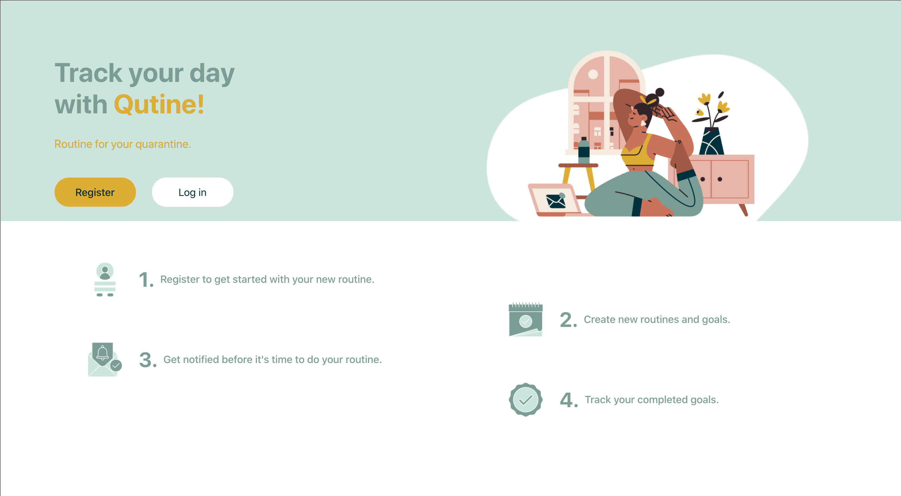
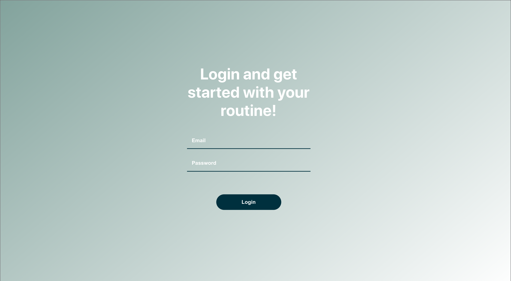
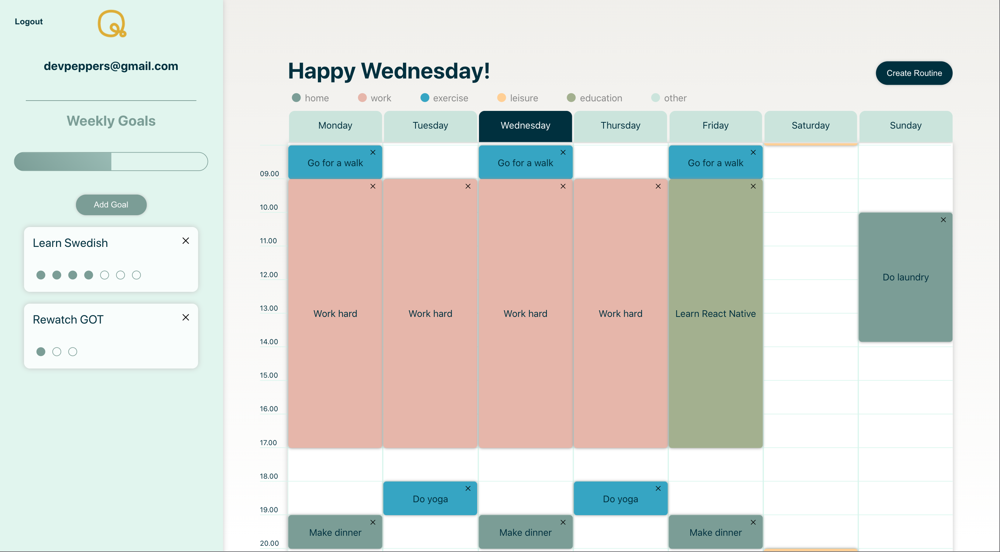

# Qutine

### What is Qutine?
During the pandemic people are more isolated which, in many cases, leads to lack of structure and routine in quarantine. We believe this may influence a persons health in a negative way. Our target audience is anyone in isolation. Anyone needing more structure and routine in their life can benefit from our application.

The problems our target audience is facing is lack of structure and routine. Our solution is an application where you in a simple and visual way can structure your daily routines. You will also be able to add weekly goals. To visually represent your weekly structure will help you creating and maintaining your routine. Our goal is to help people stay healthy in times where maintaining a daily structure is more difficult.

### Environment

Production link = https://qutine.herokuapp.com/dashboard

### Installation

Backend port = 4000
Frontend port = 3001

### Deploy

(1) install heroku cli
https://devcenter.heroku.com/articles/heroku-cli

(2) cd into qutine

(3) heroku login

(4) git push heroku master
